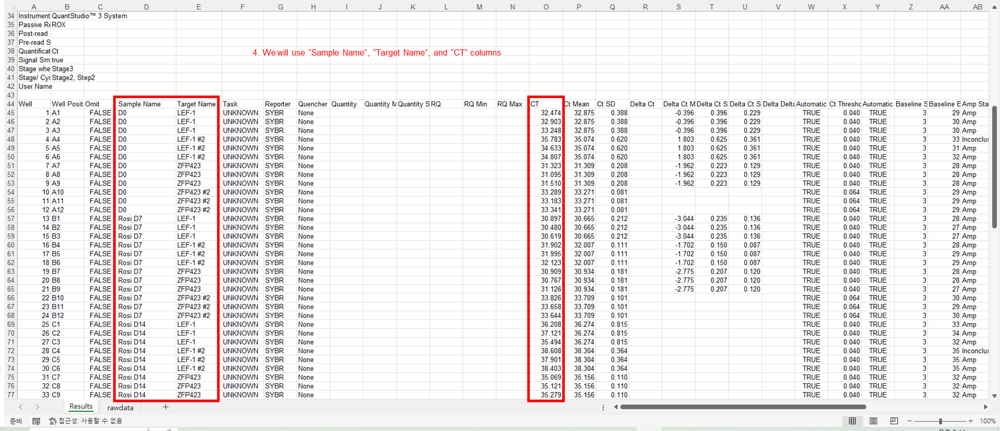
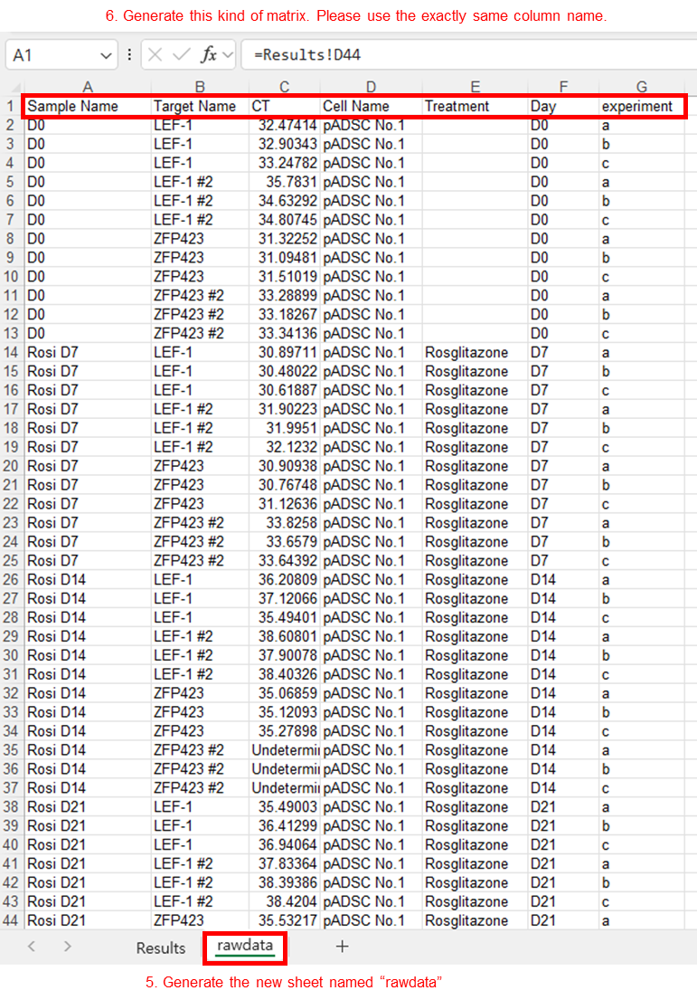

# About qpsear

qpsear is an R package that automates preprocessing, outlier detection, statistical analysis, and visualization of qPCR raw data. Originally developed for outputs from Applied Biosystems qPCR instruments, it works directly with simple .xls matrices and can be applied to any qPCR dataset that follows this format.

## Installation

```r
# CRAN version
install.packages("qpsear")

# Development version (GitHub)
remotes::install_github("wez-97/qpsear")
```

### Quick Start

# 0. Export rawdata from Quantstudio™ Design & Anaylsis Software 
# If you do not use Applied Systems qpcr instrument, skip this step.


# 0. Prepare matrix for qpsear anaylsis 
# Generate the rawdata matrix and name that sheet as "rawdata"
# **Warning:** Column names must match exactly as shown, including capitalization and spaces.



